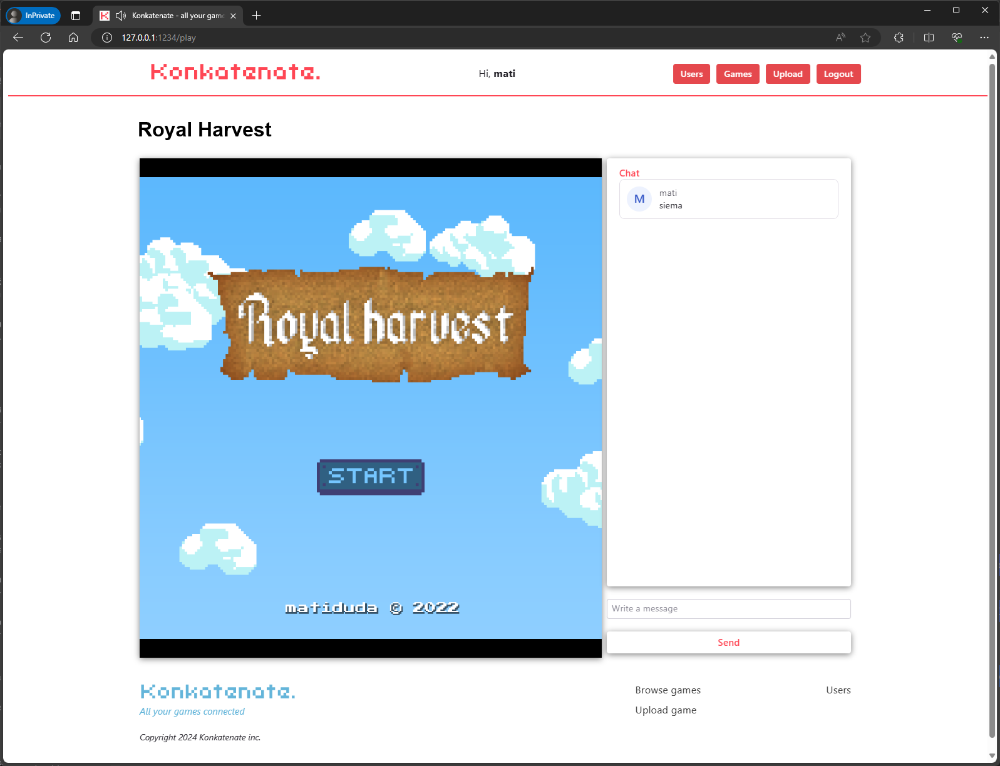

# konkatenate
HTML5 game repository with live chat, inspired by [kongregate.com](https://www.kongregate.com/). Backend in Java / Spring Boot, frontend in React.

    

Features:

- JWT Authentication
- Live chat with rooms based on Stomp protocol
- Dynamically saving and serving static content (html iframes)
- Easily expandable with more features

# Special thanks

- Awesome [Spring Boot tutorials](https://www.youtube.com/watch?v=VqptK6_icjk&list=PL82C6-O4XrHejlASdecIsroNEbZFYo_X1) by [Teddy Smith](https://www.youtube.com/@TeddySmithDev)
